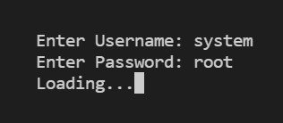
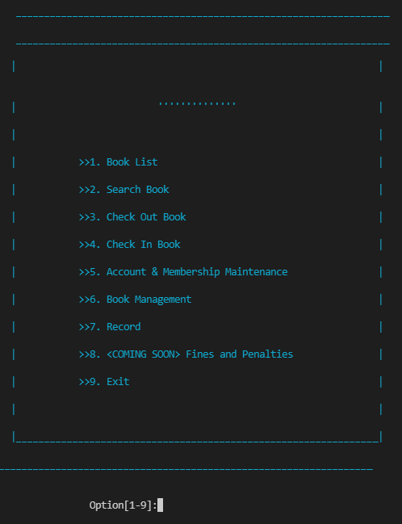
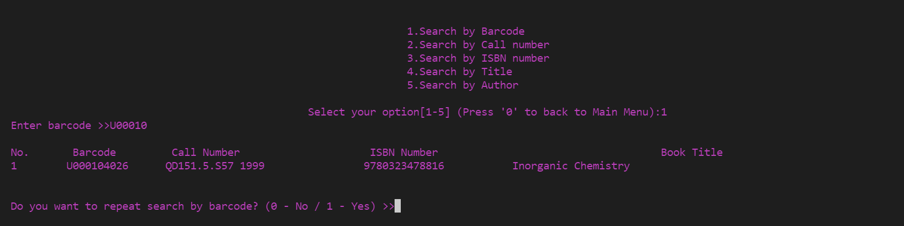
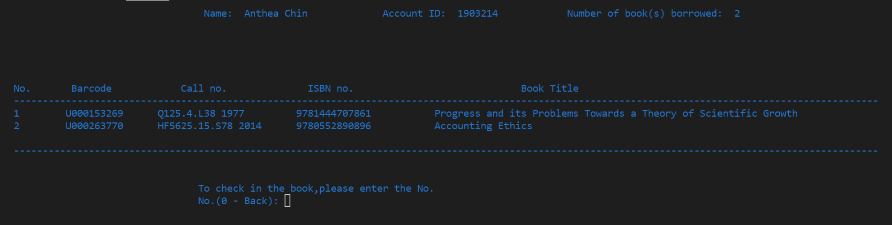
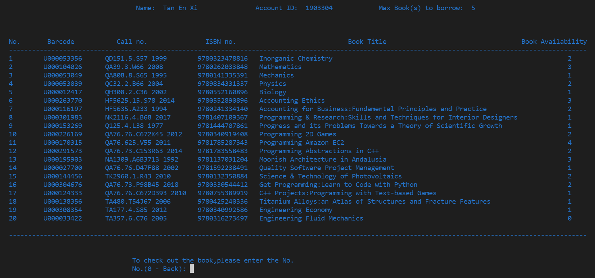
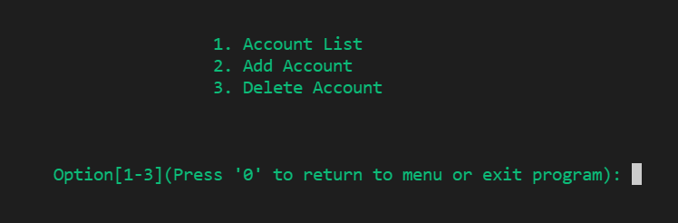
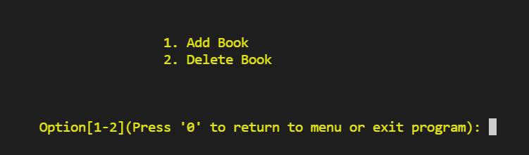
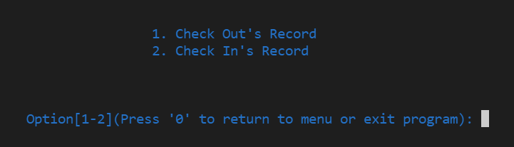

# LibrarySystem

## Overview
This is a simple library system created using Python with the following functions:
1. View Book List
2. Search Book
3. Check Out (Borrow) Book
4. Check In (Return) Book
5. Account & Membership Maintenance
6. Book Management
7. Check In & Check Out Records

This system applies structured programming approach.

## Tools
1. Python 3.7

## Usage
Import the files into the project.
Run the project with 

Enter the system using username and password below:
username: system
password: root

## Test
No testing has been performed.

## Previews
1. Login   
2. Main Menu   
3. Search Book   
4. Check Out Book   
5. Check In Book   
6. Account & Membership Maintenance   
7. Book Management   
8. Check In & Check Out Records   
